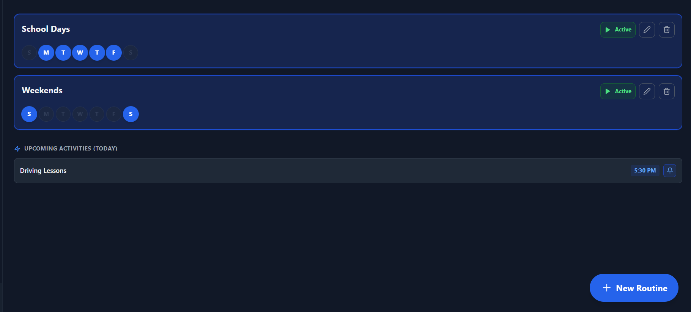
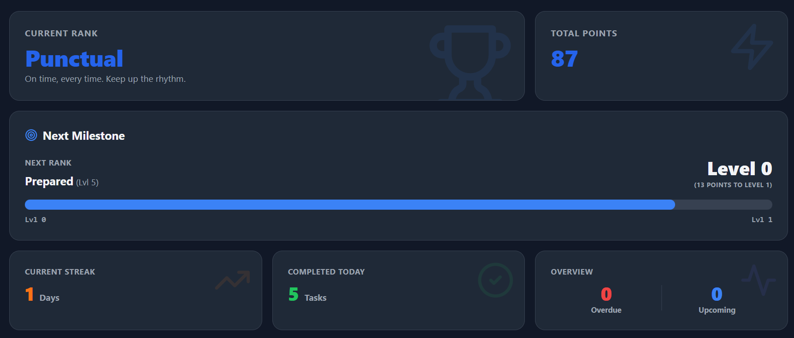
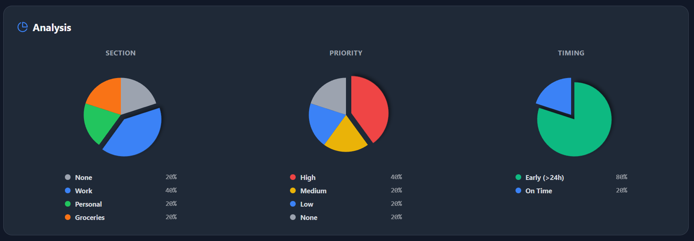

# 🌱 Do To Do

**Do To Do** is a gamified productivity web application designed to help you manage tasks, build routines, schedule events, and understand your productivity patterns. With dynamic color themes, points-based motivation, a shareable profile card, and both board and list task views, **Do To Do** transforms your workflow into a rewarding experience.

Visit the site Live at https://dotodo-one.vercel.app/

---

## 🚀 Features

### 📝 Four Main Menus
**Do To Do** is organized into four easy-to-use sections:

1. **Tasks** – Manage your to-dos with both Board and List views  
2. **Scheduling** – Plan ahead and Schedule Tasks with a visual calendar  
3. **Routines** – Build daily habits and Follow routines with reminders  
4. **Dashboard** – View your Progress and Analyze your productivity insights  

---

## 🧩 Tasks
- Create, edit, and delete tasks  
- Switch between **Board View** and **List View** to fit your style
- Organize and filter tasks for clarity  
- Intuitive interface designed to keep you moving forward

  
  

---

## 📅 Scheduling
- Schedule tasks using the built-in calendar  
- View tasks by day, week, or month  
- Identify overloaded or free days at a glance

  
  

---

## 🔔 Routines
- Create personalized daily routines  
- Receive automated reminders  
- Build long-term consistency  

  

---

## 🌗 Dark Mode
- Toggle seamless **Dark Mode** for nighttime productivity  
- Preserves colors and theme levels perfectly  

  
  

---

## 🏖️ Vacation Mode
- Pause all reminders and notifications  
- Take a break without lowering your score  
- Resume smoothly when you're ready  

---

## 🎮 Gamified Productivity System

Earn points for completing tasks early and lose points for overdue tasks.  
Your productivity determines your **color theme**, evolving with your performance:

| Level | Color | Meaning |
|-------|--------|---------|
| **Procrastinator** | 🔴 Red | Frequently overdue |
| **Postponer** | 🟠 Orange | Needs improvement |
| **Punctual** | 🔵 Blue | Consistently on time |
| **Prepared** | 🟩 Lime | Reliable and well-organized |
| **Proactive** | 🟢 Green | Excellent planning and execution |

Your UI theme changes dynamically as your score grows.

---

## 📊 Productivity Dashboard
- Visualize completed, overdue, and upcoming tasks  
- Track daily consistency and routine performance  
- Understand patterns to improve efficiency

  
  

---

## 🪪 Shareable Profile Card

  
  Automatically generated Profile Card based on your progress, which displays Productivity level, Theme color, Total tasks completed and Streak along with unocked avatars.

---

